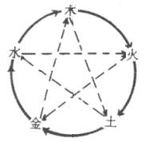

# 五行和五脏

[原文链接](http://bjtime.cn/info/view.asp?id=68)

## 五行和人体的对应关系

五行就是木、火、土、金、水，代表五种属性，是抽象概念，不要理解具体的某种东西。五是个普遍的数字，五指、五官、五脏、五味。。。有很多事物可以分为五类。

在中医里，用五行描述人体五脏系统（肝心脾肺肾）的功能和关系，注意这里的五脏也是个功能概念（称为藏象），并不限于具体的解剖上的五脏。

    木－生长、生法、柔和、条达舒畅
    火－温热、升腾、明亮
    土－生化、承载、受纳
    金－清洁、清肃、收敛
    水－寒凉、滋润、向下运行
    
|五行|五脏|六腑|季节|情绪|五官|五味|形体|五神|
|:---|:---|:---|:---|:---|:---|:---|:---|---|
|木|肝|胆|春|怒|目|酸|筋|魂|
|火|心|小肠|夏|喜|舌|苦|脉|神|
|土|脾|胃|长夏|思|口|甘|肉|意|
|金|肺|大肠|秋|悲|鼻|辛|皮毛|魄|
|水|肾|膀胱|冬|恐|耳|咸|骨|志|

五脏所藏：心藏神，肺藏魄，肝藏魂，脾藏意，肾藏志。

同一行的事物相互感应，但过度则害。比如怒则伤肝。范进中举是过喜伤心的典型例子。再比如适当的甘味是补脾的，但味过于甘，又能呆胃滞脾。
 
## 五行的生克关系

实线表示相生；虚线表示相克
 
相生是指这一事物对另一事物有促进、助长和资生的作用（为叙述方便，生者称为母，被生者称为子）。相克是指这一事物对另一事物的生长和功能具有抑制和制约的作用。相生和相克是自然界普遍存在的正常现象。无生则发育无由，无制则亢而为害。两者都很重要，不要觉得相生就好，相克就不好。巨人症就是生长缺少克制的病例。

相生相克，是不可分割的两个方面。没有生就没有事物的发生和成长；没有克，就不能保持事物发展变化的平衡与协调。

## 五脏之间的关系

1. 五脏之间的相生：肝生心就是木生火，如肝藏血以济心；心生脾就是火生土，如心之阳气可以问脾；脾生肺就是土生金，如脾运化水谷之精气可以益肺；肺生肾就是金生水，如肺气清肃则津气下行以资肾；肾生肝就是水生木，如肾藏精以滋养肝的阴血等等。
2. 五脏之间的相克：肺（金）的清肃下降，可抑制肝（木）阳的上亢，即金克木；肝（木）的条达，可以疏泻脾（土）的壅滞，即木克土；脾（土）的运化，可以防止肾（水）水的泛滥，即土克水；肾（水）阴的上济，可以制约心（火）阳亢烈，即水克火；心（火）的阳热，可以制约肺（金）的清肃太过，即火克金。

但必须指出，五行学说来说明脏腑之间的平衡关系，存在一定的局限性。这是因为五脏对应五行只是抽取了五脏的部分特性，五行并不能解释世界上的一切现象，只是部分关系。
     
## 五脏病变的相互影响

1. 母病及子：母脏先病，然后累及子脏。
2. 子病及母：子脏先病，然后累及母脏。这种情况下一般病情较重。
3. 相乘：即相克太过。可能是克者太旺，或者被克者太虚造成。这种情况下病情容易严重。
4. 相侮：即克制不足，反被其克。可能是被克者太旺，或者克者太虚造成。
    
## 五脏和季节的关系

- 木对应春季，
- 火对应夏季，
- 土对应长夏，
- 金对应秋季，
- 水对应冬季。

在各个季节里，对应的脏负担较重，而所相生的脏得到补益。比如春季易流行肝病，因为春季木生火，肝的负担重。同时由于木生火（心），所以心情容易舒畅。
 
## 五脏强弱和性格的关系

在性格方面，五行生克若不平衡，火多无制,急躁而欠涵养。水多无制，聪颖而意志不坚，亦且好动。木多无制，刚愎自用。金多无制，精干而敏锐。土多无制，慈厚而好静。当然即使这样，通过后天的自我控制仍然可以达到性格平衡。
